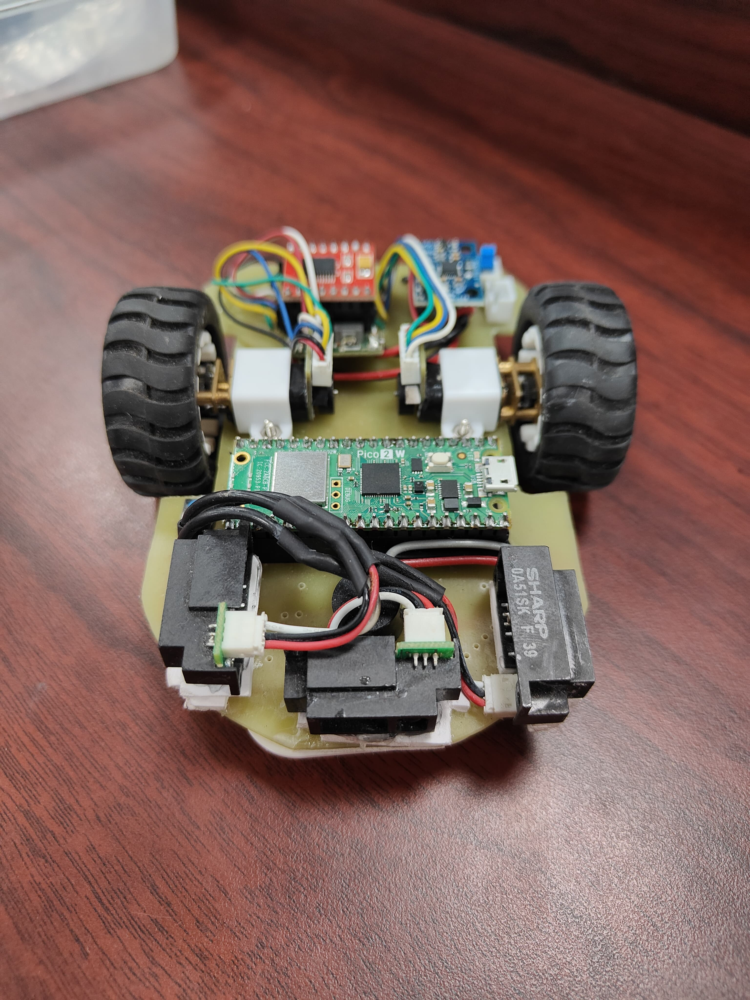

# MicroMouse Robot Project

This project implements a micromouse robot using a Raspberry Pi Pico W microcontroller. The robot is designed to solve a maze using the flood fill algorithm, with advanced motion control and wall detection capabilities.

## Hardware Implementation



The image shows the actual hardware implementation of our micromouse robot, featuring:
- Raspberry Pi Pico W at the center
- Dual motor setup with encoders
- IR sensors for wall detection
- Custom PCB design for component integration
- Compact and efficient layout

## Achievements 🏆

- 🥇 **1st Place** at IIT Roorkee's Annual Tech Fest - Cognizance '25, Micromouse Competition (Prize: ₹1,00,000)
- 🥇 **1st Place** at Delhi Technological University's Annual Tech Fest - Invictus '25, Micromouse Competition
- 🥇 **1st Place** at BITS Pilani's Annual Tech Fest - Apogee '25, Micromouse Competition
- 🥉 **3rd Place** at IIT Jodhpur's Annual Tech Fest - Prometeo '25, Micromouse Competition
- 🥉 **3rd Place** at RGIPT's Annual Tech Fest - Urjotsav '24

## Video Demonstration

Check out our micromouse robot in action:

[](https://www.youtube.com/watch?v=1PZht_hqyYY)

## Hardware Components

- **Microcontroller**: Raspberry Pi Pico W
- **Motors**: 2 DC motors with encoders
- **Sensors**:
  - IR sensors for wall detection (Left, Right, Front)
  - MPU6050 gyroscope for orientation
  - Encoders for distance measurement
- **Motor Driver**: TB6612FNG dual motor driver

## Project Structure

The codebase is organized into several key components:

1. **Cell.h/cpp**: Defines the maze cell structure and properties
2. **Int_Vector.h/cpp**: Custom vector implementation for sensor data
3. **IR_Sensors.h/cpp**: Wall detection and sensor reading functionality
4. **Maze_Algorithm.h/cpp**: Flood fill algorithm and maze solving logic
5. **Motion_Planner.h/cpp**: Movement control and motor functions
6. **Profile.h/cpp**: Global configuration and pin definitions
7. **Queue.h/cpp**: Queue implementation for flood fill algorithm

## How It Works

### 1. Initialization (setup())
- Configures serial communication
- Initializes MPU6050 gyroscope
- Sets up encoder pins and interrupts
- Configures motor driver pins
- Sets initial maze walls for the starting position

### 2. Maze Exploration Flow
The robot explores the maze in multiple rounds:
```cpp
for (int round = 1; round <= Exploration_Rounds; round++) {
    searchMode = FIND_CENTRE;  // First find the center
    findGoal();
    searchMode = FIND_START;   // Then return to start
    findGoal();
}
```

### 3. Flood Fill Algorithm
The flood fill algorithm works as follows:
1. Initializes all cells with -1 cost
2. Sets goal cells (center or start) with cost 0
3. Propagates costs to neighboring cells
4. Robot moves to the neighboring cell with lowest cost

### 4. Wall Detection
- Uses IR sensors to detect walls
- Updates maze wall information in real-time
- Maintains wall consistency between adjacent cells

### 5. Movement Control
The robot uses several movement functions:
- `moveForward()`: Move one cell forward
- `turnLeft()`: Turn 90 degrees left
- `turnRight()`: Turn 90 degrees right
- Uses PD (Proportional-Derivative) control for smooth motion
- Gyroscope feedback for accurate turns
- Encoder feedback for distance measurement

### 6. Navigation Logic
1. **Wall Update**:
   ```cpp
   updateWalls();  // Detect and update wall information
   ```

2. **Path Planning**:
   ```cpp
   floodOpenNeighbours();  // Update cell costs
   getMinDistanceDirection();  // Choose best direction
   ```

3. **Movement**:
   ```cpp
   moveInDirection();  // Execute movement
   ```

## Key Features

1. **Adaptive Movement**:
   - PD control for straight line motion
   - Gyroscope-based rotation control
   - Wall following capability

2. **Intelligent Maze Solving**:
   - Flood fill algorithm for path planning
   - Multiple exploration rounds
   - Efficient center finding and return to start

3. **Robust Sensor Integration**:
   - IR sensor filtering
   - Encoder-based distance measurement
   - Gyroscope-based orientation tracking

## Configuration

Key parameters can be adjusted in `Profile.h`:
- `MAZE_SIZE`: Size of the maze (default: 8x8)
- `Exploration_Rounds`: Number of exploration rounds
- Sensor thresholds
- Motor control parameters

## Usage

1. Upload the code to Raspberry Pi Pico W
2. Place the robot at the start position (0,0)
3. Robot will automatically:
   - Find path to center
   - Return to start
   - Repeat for specified number of rounds
   - Make final run to center

## Debugging

- LED indicators for status
- Serial output for debugging
- Button to clear maze walls
